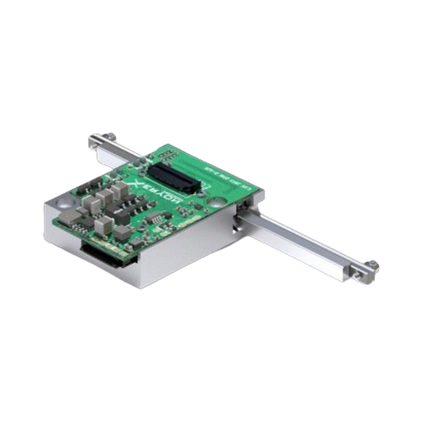
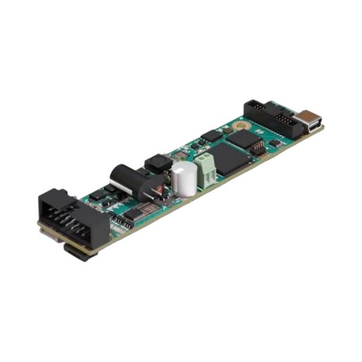
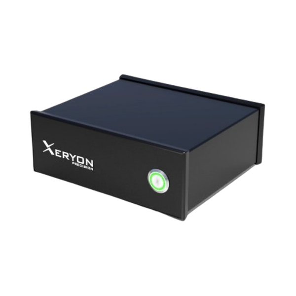
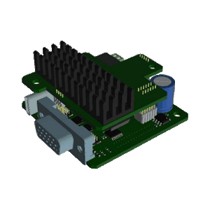

# Xeryon_Code_Examples_Overview

  

  <em>Overview of Xeryon code example repositories per controller.</em>

<table align="center" border="0" cellspacing="0" cellpadding="10">
  <tr>
    <td align="center" width="260">
      <a href="https://github.com/Xeryon-Precision/XLA-INTG_prog_examples">
         
        
      </a>
    </td>
    <td align="center" width="260">
      <a href="https://github.com/Xeryon-Precision/XD-OEM_Code_Examples">
         
        
      </a>
    </td>
  </tr>
  <tr>
    <td align="center" width="260">
      <a href="https://github.com/Xeryon-Precision/XD-M_Code_Examples">
         
        
      </a>
    </td>
    <td align="center" width="260">
      <a href="https://github.com/Xeryon-Precision/XD-C_Code_Examples">
         
        
      </a>
    </td>
  </tr>
</table>
